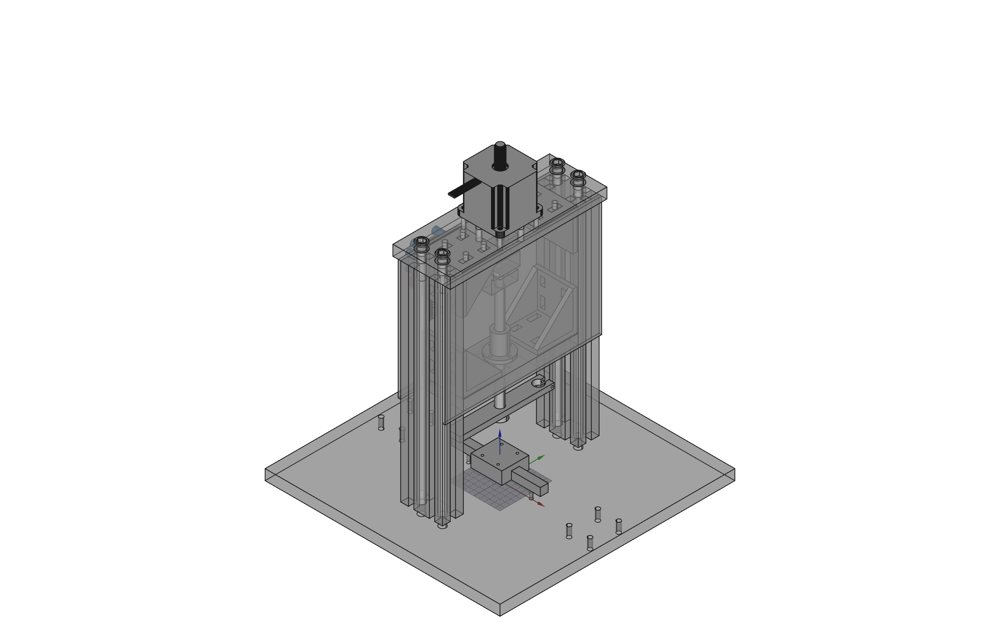
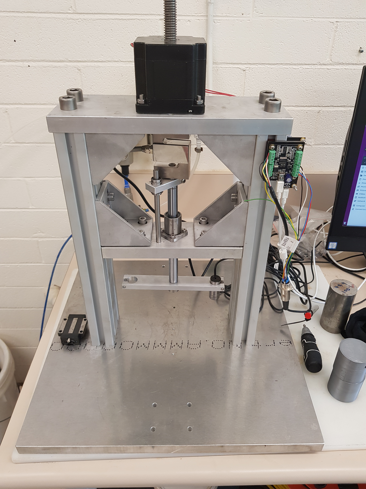

# Single Particle Breakage
This project presents the preliminary designs for a single particle breakage apparatus, developed in FreeCAD (v0.17). The apparatus will be capable of control of force/displacement in the vertical and horizontal directions using captive stepper motors. As a result, it is envisaged that ultimately the device will also be used for constant rate of strain (CRS)/controlled gradient (CG) oedometer, direct shear and simple shear testing.

As mentioned above, the design has been produced in FreeCAD and is shown in the figure below. 

Specifications
- vertical load capacity: 2kN
- vertical displacement range: 50mm (note dependent on displacement transducer for each test. e.g. currently using 10mm range)
 

The apparatus is currently been commisioned as shown in the photo below. 

